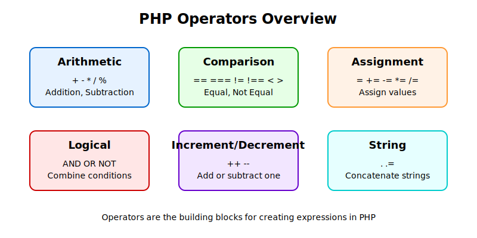

## PHP Operators
PHP operators are symbols to create mathematical, relational or logical operations.



### Arithmetic Operators
Arithmetic operators perform mathematical operations. These are probably familiar to you from basic math.

| Operator | Description | Example | Output |
|----------|-------------|---------|--------|
| + | Addition | $x + $y | Summation of $x and $y |
| - | Substraction | $x - $y | Difference of $x and $y |
| * | Multiplication | $x * $y | Product of $x and $y |
| / | Division | $x / $y | Quotient of $x and $y |
| % | Modulus | $x % $y | Remainder of $x divided by $y |
| ** | Exponentiation | $x ** $y | Raising $x to the power of $y |

```php
<?php
// Addition
$total_clients = 5 + 3; // $total_clients equals 8

// Subtraction
$remaining_bookings = 20 - 7; // $remaining_bookings equals 13

// Multiplication
$total_hours = 5 * 3; // $total_hours equals 15

// Division
$average_score = 100 / 4; // $average_score equals 25

// Modulus (remainder after division)
$remainder = 10 % 3; // $remainder equals 1

// Exponentiation (power of)
$squared = 4 ** 2; // $squared equals 16
?>
```

The modulus operator `%` gives you the remainder after division. For example, when dividing 10 by 3, you get 3 with a remainder of 1. The modulus operation returns just that remainder (1). This can be useful for determining if a number is even or odd, or for cycling through a range of values.

The exponentiation operator `**` raises the left operand to the power of the right. So `4 ** 2` means 4 raised to the power of 2, which equals 16.

### Assignment operators
Assignment operators assign values to a variable. The basic assignment operator is `=` which assigns the value on the right to the variable on the left.

| Operator | Description | Example | Output |
|----------|-------------|---------|--------|
| = | Assign | $x = 5 | $x = 5 |
| += | Addition | $x += 5 | $x = $x + 5 |
| -= | Substraction | $x -= 5 | $x = $x - 5 |
| *= | Multiplication | $x *= 5 | $x = $x * 5 |
| /= | Division | $x /= 5 | $x = $x / 5 |
| %= | Modulus | $x %= 5 | $x = $x % 5 |
| .= | Concatenation | $x .= "text" | $x = $x . "text" |

```php
<?php
// Basic assignment
$project_name = "Community Health Initiative";

// Combined assignment operators
$total_beneficiaries = 200;
$total_beneficiaries += 50; // Same as: $total_beneficiaries = $total_beneficiaries + 50
// $total_beneficiaries now equals 250

$available_slots = 30;
$available_slots -= 5; // Same as: $available_slots = $available_slots - 5
// $available_slots now equals 25

$monthly_sessions = 4;
$monthly_sessions *= 3; // Same as: $monthly_sessions = $monthly_sessions * 3
// $monthly_sessions now equals 12

$team_size = 12;
$team_size /= 3; // Same as: $team_size = $team_size / 3
// $team_size now equals 4

$leftover_supplies = 22;
$leftover_supplies %= 5; // Same as: $leftover_supplies = $leftover_supplies % 5
// $leftover_supplies now equals 2
?>
```

### Comparison operators
Comparison operators compare two values and return a boolean (true or false).

| Operator | Description | Example | Output |
|----------|-------------|---------|--------|
| == | Equal | $x == $y | If $x is equal to $y, returns `true` |
| === | Identical | $x === $y | If $x is equal to $y and have the same type, returns `true` |
| != | Not equal | $x != $y | If $x is not equal to $y, returns `true` |
| <> | Not equal | $x <> $y | If $x is not equal to $y, returns `true` |
| !== | Not identical | $x !== $y | If $x is not equal to $y or they are just not having the same type, returns `true` |
| > | Greater than | $x > $y | If $x is greater than $y, returns `true` |
| < | Less than | $x < $y | If $x is less than $y, returns `true` |
| >= | Greater than or equal | $x >= $y | If $x is greater than or equal to $y, returns `true` |
| <= | Less than or equal | $x <= $y | If $x is less than or equal to $y, returns `true` |
| <=> | Spaceship | $x <=> $y | If $x < $y, returns `-1`, If $x == $y, returns `0`, if $x > $y, returns `1` |

```php
<?php
// Equal
$is_same = (5 == "5"); // Returns true because the values are equal, regardless of type

// Identical
$is_identical = (5 === "5"); // Returns false because the types are different (integer vs string)

// Not equal
$is_not_equal = (5 != 10); // Returns true because 5 is not equal to 10

// Not identical
$is_not_identical = (5 !== "5"); // Returns true because they are not identical

// Greater than
$is_greater = (10 > 5); // Returns true

// Less than
$is_less = (3 < 7); // Returns true

// Greater than or equal to
$is_greater_equal = (10 >= 10); // Returns true

// Less than or equal to
$is_less_equal = (5 <= 10); // Returns true

// Spaceship operator (returns -1, 0, or 1)
$comparison = (5 <=> 10); // Returns -1 because 5 is less than 10
$comparison = (10 <=> 10); // Returns 0 because 10 equals 10
$comparison = (15 <=> 10); // Returns 1 because 15 is greater than 10
?>
```

The `==` operators checks whether two values are equal, no matter what their types are. The `===` operator checks both value and type. The spaceship operator `<=>` was added since php7. If the left side is smaller, it returns `-1`. If they're equal returns `0`. If the left side is greater, returns `1`. This is useful for sorting functions.

### Increment/Decrement operators
Increment and decrement operators are used to increase or decrease the values of a variable.

| Operator | Description | Example | Output |
|----------|-------------|---------|--------|
| ++$x | Pre-increment | Increments $x by one, then returns $x |
| $x++ | Post-increment | Returns $x, then increment by one |
| --$x | Pre-decrement | Decrements $x by one, then returns $x |
| $x-- | Post-decrement | Returns $x, then decrements by one |

```php
<?php
// Post increment
$attendees = 5;
echo $attendees++; // The result is 5, then incremented to 6
echo $attendees; // The result is 6

// Pre increment
$staff = 8;
echo ++$staff; // Incremented to 9 then result is 9

// Post decrement
$available_meeting_rooms = 3;
echo $available_meeting_rooms--; // The result is 3, then decremented to 2
echo $available_meeting_rooms; // The result is 2

// Post increment
$shortlisted_candidates = 15;
echo --$shortlisted_candidates; // Decremented to 14, the result is 14
?>
```

### Logical Operators
Logical operators are used to combine conditional statements.

| Operator | Description | Example | Output |
|----------|-------------|---------|--------|
| and | And | $x and $y | True if both $x and $y are true |
| or | Or | $x or $y | True if either of $x or $y is true |
| xor | Exclusive or | $x xor $y | True if either $x or $y is true, but not both |
| ! | Not | !$x | True if $x is not true |
| && | And | $x && $y | True if both $x and $y are true |
| &#124;&#124; | Or | $x &#124;&#124; $y | True if either $x or $y is true |

```php
// AND (&&)
$is_eligible = ($age >= 18 && $has_id == true); // True if both conditions are true

// OR (||)
$can_register = ($is_migrant_worker || $is_influx); // True if either condition is true

// NOT (!)
$pending_registration = !$form_submitted; // True if $form_submitted is false

// Example
$age = 25;
$has_id = true;

if ($age >= 18 && $has_id) {
    echo "You are eligible for this program.";
} else {
    echo "Sorry, you are not eligible for this program."
}

```

### String operators

PHP has two string operators. The concatenation operator `.` joins two strings values together. The concatenation assignment operator `.=` appends the right string value to the left.

```php
<?php
$first_name = "Anton";
$last_name = "Chekhov";
$full_name = $first_name . " " . $last_name;
echo $full_name; // Anton Chekhov

$email_body = "Dear ";
$email_body .= $full_name; // The same as $email_body = $email_body . $full_name
$email_body .= ",\n\nThank you for your registration.";
echo $email_body;

/*
Dear Anton Chekhov,

Thank you for your registration.
*/
?>
```

### Operator precedence

Just like in mathematical calculations, PHP also has rules on which operators are going to be implemented first when different operators are used together. This is called operator precedence.

```php
<?php
// Without parentheses
$result = 5 + 3 * 2; // Multiplication implemented first as 3 * 2 = 6. Then addition 5 + 6 = 11
$echo $result;

// With parentheses
$result = (5 + 3) * 2; // Addition first 5 + 3 = 8. Then multiplied as 8 * 2 = 16
$echo $result;

// We can also use parentheses for complex logical conditions
// The condition is complex and prone to unexpected results
$is_eligible = $age >= 18 && $has_id = true || $special_exemption = true;

// Parentheses can be added for more clarity
$is_eligible = ($age >= 18 && $has_id = true) || $special_exemption = true;
?>
```

When you're in doubt, you can add parentheses to make complex conditions become clear. This not only makes the code more readable but also makes sure the code works as expected.

## Examples

### Calculating available slots for a training program

```php
<?php
// Total planned participants
$total_capacity = 50;

// Current puglic registration
$current_public_registration = 32;

// Number of seats occupied by staff
$staff_attending = 5;

// Reserved seats for emergencies
$emergency_seats = 3;

// Available seats
$available_seats = $total_capacity - $current_public_registration - $staff_attending - $emergency_seats;

echo "Available seats for public registration - " . $available_seats;
?>
```

### Determining eligibility for assistance

```php
<?php
// Client details
$family_size = 5;
$monthly_income = 1200;
$has_children_under_18 = true;
$is_single_parent = false;

// Assistance criteria
$income_threshold = 2000;
$income_per_person_threshold = 500;

// Income per person
$income_per_person = $monthly_income / $family_size;

// Check eligibility based on criteria
$is_eligible = ($monthly_income < $income_threshold) && ($income_per_person < $income_per_person_threshold) && ($has_children_under_18 || $is_single_parent);

if ($is_eligible) {
    echo "Client is eligible for the assistance program.";
} else {
    echo "Client does not meet all specified criteria of the assistance program.";
}
?>
```

## Summary

In this lesson, we have covered -
* Arithmetic operators that can perform mathematical operations
* Assignment operators for assigning values to variables
* Comparison operators for checking conditions
* Increment/Decrement operators for adding/substracting value by one
* Logical operators for combining conditions
* String operators for combining text
* Operator precedence and the role of parentheses

## Resources

* [PHP Operators Documentation](https://www.php.net/manual/en/language.operators.php)
* [W3Schools PHP Operators Tutorial](https://www.w3schools.com/php/php_operators.asp)
* [PHP Operator Precedence Table](https://www.php.net/manual/en/language.operators.precedence.php)

## Exercises

1. Create a script to check whether a client is eligible for an assistance program based on the following criteria.
    * The client must be either above 65 years old **OR** under 18.
    * **AND** the client must have been registered in your system for at least 30 days.
    * **AND** the client must not have participated in any other assistance program in the last 90 days.

2. Write a script to display a confirmation message for a workshop registration including participant's name, workshop title, date and location.

3. Create a script to calculate the following scenerio. Your organization is going to create volunteer teams with 5 volunteers per team. You have 37 volunteers currently. How many teams of 5 volunteers can you create? How many people will be left without forming a full team?
