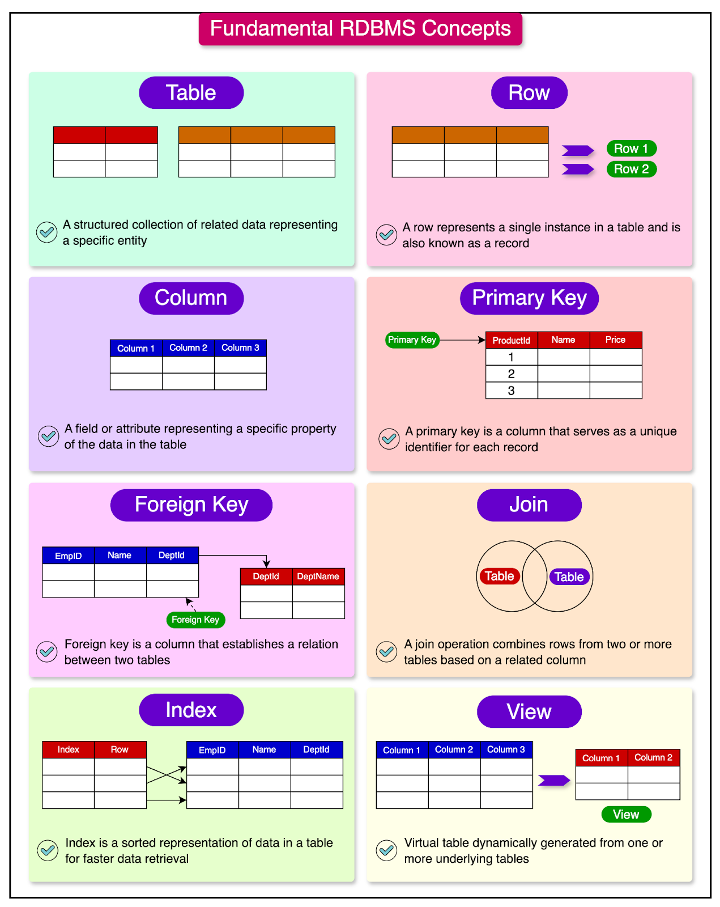

# Database Structures

## Components of a database



Source: Byte Byte Go

### Tables

Tables are the primary storage components in relational databases. A table as similar to a spreadsheet. Each table stores information about an entity (e.g., clients, services, staff). Tables are composed of rows and columns.

Example of a simple CLIENT table:

| client_id | first_name | last_name | date_of_birth | nationality | status    |
|-----------|------------|-----------|---------------|-------------|-----------|
| 1         | John       | Doe       | 1985-03-15    | Myanmar     | Active    |
| 2         | Jane       | Smith     | 1990-07-22    | Syria       | Pending   |
| 3         | Ahmed      | Hassan    | 1978-11-30    | Somalia     | Completed |

### Columns (Fields)

Columns, also known as fields, define the properties of the entity. Each column has a name (e.g., first_name, date_of_birth) and has a specific data type (e.g., integer, varchar, date). Columns may have constraints that limit what data can be stored.

### Rows (Records)

Rows, also called records, contain the actual data. Each row represents one record of the entity (e.g., one client). Rows must follow the structure defined by the columns. Each row has a unique identifier.

### Data Types

Every column in a database table must have a specified data type. Common MySQL data types are -

| Data Type Category | Examples | Use Cases |
|--------------------|----------|-----------|
| Numeric | INT, DECIMAL, FLOAT | Client IDs, ages, financial amounts |
| String | VARCHAR, TEXT, CHAR | Names, addresses, descriptions |
| Date and Time | DATE, DATETIME, TIMESTAMP | Birth dates, appointment times |
| Boolean | BOOLEAN (TINYINT(1)) | Active status, eligibility flags |
| Binary | BLOB, BINARY | Documents, images (though often stored outside DB) |

> The difference between FLOAT and DECIMAL is that DECIMAL stores exact values (ideal for financial data where precision is important), while FLOAT stores approximate values and is more efficient for scientific calculations where absolute precision is less important.

> CHAR has fixed length and VARCHAR has variable length. TEXT has large variable-length content with no size limit. CHAR stores string values with fixed size, no more and no less. VARCHAR can store string values of variable length not exceeding the specified upper limit. VARCHAR saves more space than TEXT and since TEXT has no limit, it has slower performance.

Choosing the right data type is important for **Data integrity**, **Storage efficiency** and **Query performance**.

## Keys

Keys serve as record id and take care of relationships between tables.

### Primary Keys

A primary key is an id of a record.No two rows can have the same primary key value. Primary keys cannot contain NULL values. Like a country has only one national idenfication system for its own nationals, a table can have only one primary key column (though it can consist of multiple columns).

Example:
```sql
CREATE TABLE clients (
    client_id INT AUTO_INCREMENT PRIMARY KEY,
    first_name VARCHAR(50) NOT NULL,
    last_name VARCHAR(50) NOT NULL
);
```

In this example, `client_id` is the primary key that identifies each client.

### Foreign Keys

Foreign keys create relationships between tables. Similar to a person became a foreigner in a country abroad, a record's primary key can be a foreign key in another table (like a passport number from a native country becomes a foreigner identification number in another country). Foreign keys make sure a reference record actually exists in the original table and they prevent orphaned records (records with references to non-existent data).

Example
```sql
CREATE TABLE appointments (
    appointment_id INT AUTO_INCREMENT PRIMARY KEY,
    client_id INT NOT NULL,
    appointment_date DATETIME NOT NULL,
    FOREIGN KEY (client_id) REFERENCES clients(client_id)
);
```

Here, `client_id` in the appointments table is a foreign key that references the `client_id` primary key in the clients table.

### Composite Keys

Sometimes, a single column isn't enough to uniquely identify a record. In such cases, we use composite keys. A composite key consists of two or more columns. The combination of these columns must be unique for each record.

Example:
```sql
CREATE TABLE enrollment (
    program_id INT,
    client_id INT,
    enrollment_date DATE,
    PRIMARY KEY (program_id, client_id),
    FOREIGN KEY (program_id) REFERENCES programs(program_id),
    FOREIGN KEY (client_id) REFERENCES clients(client_id)
);
```

In this table, neither `program_id` nor `client_id` alone can be a primary key, but their combination is unique.

## Database Schema Design

A database schema is the blueprint of your database structure. Proper schema design is important before starting to create database and tables. Database performance, data integrity, and future scalability is better in well-designed databases.

### Normalization

Normalization is like organizing your physical files, with each step making your data more organized and efficient. There are 3 Normalization forms in practice.

#### First Normalization Form (1NF)

In 1NF stage, each column must have only one value (when a client has more than one phone number, the phone number column must store only one number. For another phone number, a new column or a separate table should be created).

#### Second Normalization Form (2NF)

2NF should follow 1NF. If there are two keys on the same table (composite keys), and other columns directly belongs to only one key, this key and belonging columns should be separated as another table.

#### Third Normalization Form (3NF)

3NF should follow 2NF. If a table still have columns that are not directly related to the primary key, these columns should be separated to a new table. In other words, it is called eliminating the transitive dependencies.

**Before Normalization**

| client_id | client_name  | service1       | service1_date | service2       | service2_date | service3       | service3_date | case_manager  | case_manager_phone |
|-----------|--------------|----------------|---------------|----------------|---------------|----------------|---------------|---------------|-------------------|
| 1         | John Doe     | Legal Aid      | 2025-01-15    | Food Support   | 2025-02-10    | Housing        | 2025-03-01    | Mary Johnson  | 555-1234          |
| 2         | Jane Smith   | Medical Care   | 2025-01-20    | Counseling     | 2025-02-15    | NULL           | NULL          | Mary Johnson  | 555-1234          |
| 3         | Ahmed Hassan | Food Support   | 2025-01-25    | NULL           | NULL          | NULL           | NULL          | James Wilson  | 555-5678          |

In this table, there are exactly three services. If a client needs 4 active services, where should the data be saved? And for clients with only one active service, other service columns are set as NULL. And the case manager name and phone number were repeated for every client. When the case manager switches to another phone number, every line with the previous phone number needs to be updated. This table structure is also difficult to query. e.g. Which clients received food support?

**After Normalization**

*Clients Table*
| client_id | client_name  | case_manager_id |
|-----------|--------------|-----------------|
| 1         | John Doe     | 101             |
| 2         | Jane Smith   | 101             |
| 3         | Ahmed Hassan | 102             |


*Services Table*
| service_id | service_name  |
|------------|---------------|
| 1          | Legal Aid     |
| 2          | Food Support  |
| 3          | Housing       |
| 4          | Medical Care  |
| 5          | Counseling    |

*Client_Services Table*
| client_id | service_id | service_date |
|-----------|------------|--------------|
| 1         | 1          | 2025-01-15   |
| 1         | 2          | 2025-02-10   |
| 1         | 3          | 2025-03-01   |
| 2         | 4          | 2025-01-20   |
| 2         | 5          | 2025-02-15   |
| 3         | 2          | 2025-01-25   |

*Case_Managers Table*
| case_manager_id | case_manager_name | case_manager_phone |
|-----------------|-------------------|-------------------|
| 101             | Mary Johnson      | 555-1234          |
| 102             | James Wilson      | 555-5678          |

With this normalization structure, there is no limits on the number of services per client and no null values for missing services. The case manager information is stored only once. It is easy to query (e.g., "SELECT client_name FROM Clients JOIN Client_Services ON Clients.client_id = Client_Services.client_id WHERE service_id = 2"). And when one data is updated, it is also consistent accross related tables (updating a case manager's phone number only requires changing one record).

### Example

```
CLIENTS                           SERVICES
+-----------------+               +------------------+
| client_id (PK)  |               | service_id (PK)  |
| first_name      |               | service_name     |
| last_name       |               | description      |
| date_of_birth   |               | duration         |
| nationality     |               +------------------+
| status          |                        ^
+-----------------+                        |
        ^                                  |
        |                                  |
        |      SERVICE_DELIVERY            |
        +----> +---------------------+ <---+
               | delivery_id (PK)    |
               | client_id (FK)      |
               | service_id (FK)     |
               | delivery_date       |
               | staff_id (FK)       |
               | notes               |
               +---------------------+
                        |
                        v
                    STAFF
               +------------------+
               | staff_id (PK)    |
               | first_name       |
               | last_name        |
               | position         |
               | email            |
               +------------------+
```

In this database schema, primary keys (PK) identify each record. Foreign keys (FK) establish relationships. Tables are organized by entity type. And a normalized structure is used to minimize redundancy.

## Indexes

Indexes improve the speed of data query. They are similar to an index in a book. Index increases read performance, but may slow down writes. They should be created on columns frequently used in WHERE clauses, joins, and sorting.

Types of indexes include **Primary key index** which are automatically created for primary keys, **Unique index** to ensure all values in a column are unique, **Composite index**: Index on multiple columns, and **Full-text index** for text searching.

Example
```sql
CREATE INDEX idx_client_nationality ON clients(nationality);
```

This creates an index on the nationality column to speed up queries that filter by nationality.

## Constraints

Constraints enforce rules on data to maintain integrity.

- **NOT NULL** constraint ensures a column cannot have NULL values
- **UNIQUE** constraint ensures all values in a column are unique
- **CHECK** constraint ensures values meet specified conditions
- **DEFAULT** constraint provides a default value when none is specified
- **FOREIGN KEY** ensures reference integration

Example:
```sql
CREATE TABLE clients (
    client_id INT AUTO_INCREMENT PRIMARY KEY,
    first_name VARCHAR(50) NOT NULL,
    last_name VARCHAR(50) NOT NULL,
    email VARCHAR(100) UNIQUE,
    age INT CHECK (age >= 0),
    registration_date DATE DEFAULT CURRENT_DATE
);
```

## Summary

In this lesson, we've covered the fundamental structures of relational databases (tables, columns, rows), different data types and when to use them, the importance of keys in establishing relationships and ensuring data integrity, basic principles of database schema design, how indexes can improve query performance, constraints that help maintain data integrity.

Understanding these structures will help you design and interact with databases effectively, making it easier to manage and retrieve the information needed for operations.

## Resources
- [Database Normalization Explained](https://www.essentialsql.com/get-ready-to-learn-sql-database-normalization-explained-in-simple-english/)
- [MySQL Data Types](https://dev.mysql.com/doc/refman/8.0/en/data-types.html)
- [Database Indexing Strategies](https://use-the-index-luke.com/)

## Exercises
1. Identify three entities (tables) that might exist in your database and list potential columns for each.
2. For each table identified in Exercise 1, determine appropriate primary keys and any potential foreign keys.
3. Choose appropriate data types for 5 different pieces of information that might collect about clients.
4. Consider a table that stores client case notes. What indexes might improve performance when searching through this data?
