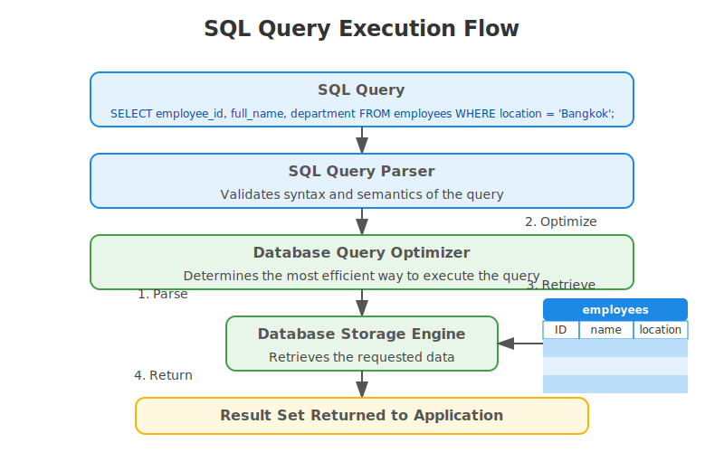

# Basic SQL queries

Structured Query Language (SQL) is the standard language for communicating with relational databases.

## SELECT

The `SELECT` keyword is the most commonly used SQL command. It is used to get data from the database.

**Basic syntax**

```sql
SELECT column1, column2, ...
FROM table_name;
```

**Selecting all columns**

```sql
SELECT * FROM employees;
```

## Filtering the results

The `WHERE` keyword filters the results with a specific condition.

```sql
SELECT column1, column2, ...
FROM table_name
WHERE condition;
```

**Example**
```sql
-- Find clients from a city
SELECT * FROM clients
WHERE city = 'Bangkok';

-- Find services with costs greater than 5,000
SELECT service_name, cost
FROM services
WHERE cost > 5000;
```

### Comparison operators

| Operator | Description               |
|----------|---------------------------|
| =        | Equal to                  |
| >        | Greater than              |
| <        | Less than                 |
| >=       | Greater than or equal to  |
| <=       | Less than or equal to     |
| <>       | Not equal to              |

### Logical Operators

They are used to combine multiple conditions for a WHERE filter.

#### AND

Get records that match both conditions before and after the `AND` keyword.
```sql
SELECT * FROM malaria_cases
WHERE age < 18 AND gender = 'female';
```

#### OR

Get records that match at least one condition.
```sql
SELECT * FROM malaria_cases
WHERE malaria_parasite = 'p.f' OR malaria_parasite = 'p.v';
```

#### NOT

Exclude a condition.
```sql
SELECT * FROM malaria_cases
WHERE NOT 'occupation' = 'others';
```

## Sorting results

The query results can be sorted with `ORDER BY` keyword.

**Syntax**
```sql
SELECT column1, column2, ...
FROM table_name
ORDER BY column1 [ASC|DESC];
```

**Example**
```sql
-- Sort clients by last name A to Z
SELECT * FROM clients
ORDER BY last_name ASC;

-- Sort services by costs, highest to lowest
SELECT service_name, cost
FROM services
ORDER BY cost DESC;
```

## Limiting results

Useful for data-visualization purposes. For example, a chart of top-ten case managers sorted by number of clients in this month, top five clients who received maximum financial support this month.

**Example**
```sql
SELECT * FROM clients
ORDER BY age DESC
LIMIT 10;
```
**SQL query execution flow**



## Summary

In this lession, we have covered -
* Getting data with `SELECT` keyword
* Filtering with `WHERE`
* Using operators to join filter conditions
* Limiting the number of results

## Resources
- [W3Schools SQL Tutorial](https://www.w3schools.com/sql/)
- [MySQL Documentation](https://dev.mysql.com/doc/refman/8.0/en/select.html)
- [SQL Cheat Sheet](https://www.sqltutorial.org/sql-cheat-sheet/)

