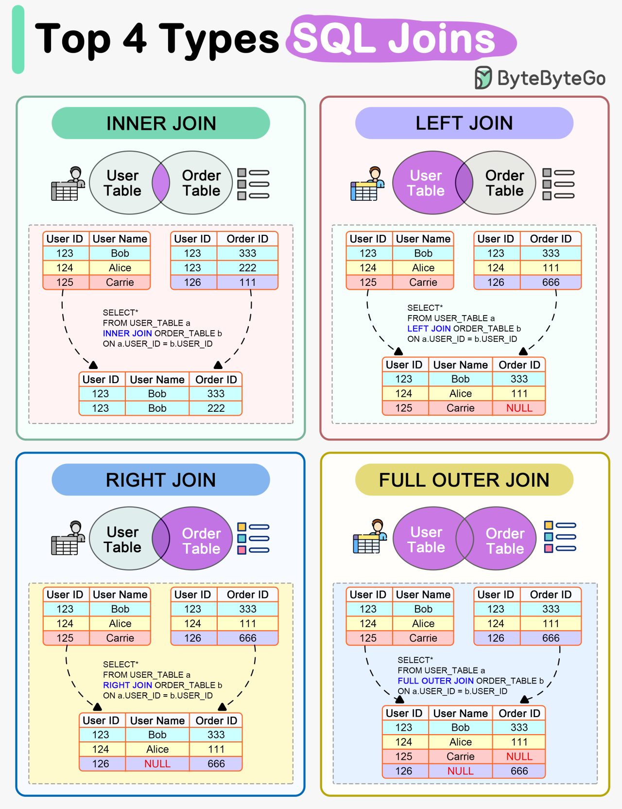

# SQL Joins

SQL joins are used to combine records from multiple tables. To be able to join, we need to find something in common between the tables. So if the tables have primary key and foreign key related to each other, via relationship, we can join the related records together.

## Join types

### INNER JOIN

The INNER JOIN returns only the rows that have matching values in both tables.

```sql
SELECT column1, column2, ...
FROM table1
INNER JOIN table2 ON table1.column_name = table2.column_name;
```

**Example**

Get a list of all employees together with their department names. Only employees who are assigned at least to a department will show up.

```sql
SELECT e.employee_id, e.full_name, d.department_name
FROM employees e
INNER JOIN departments d ON e.department_id = d.department_id
ORDER BY e.full_name;
```

### LEFT JOIN (LEFT OUTER JOIN)

LEFT JOIN prioritizes left. It gets all rows from left table and only matching rows from the right table. If the right table doesn't have a matching value to the left, NULL is returned.

```sql
SELECT column1, column2, ...
FROM table1
LEFT JOIN table2 ON table1.column_name = table2.column_name;
```

**Example**

Get a list of all employees together with department names. All employees will show up. Those not yet assigned to a department will return NULL under their department column.

```sql
SELECT e.employee_id, e.full_name, d.department_name
FROM employees e
LEFT JOIN departments d ON e.department_id = d.department_id
ORDER BY e.full_name;
```

### RIGHT JOIN (RIGHT OUTER JOIN)

RIGHT JOIN prioritizes right. All rows from right table will be shown while only matching rows from left table will join. Likewise, non-matching records will have NULL values in left table.

```sql
SELECT column1, column2, ...
FROM table1
RIGHT JOIN table2 ON table1.column_name = table2.column_name;
```

**Example**

Get a list of all departments together with employees assigned to them. Departments with no employees will also show up.

```sql
SELECT d.department_id, d.department_name, e.full_name
FROM employees e
RIGHT JOIN departments d ON e.department_id = d.department_id
ORDER BY d.department_name, e.full_name;
```

### FULL JOIN (FULL OUTER JOIN)

The FULL JOIN returns all rows when there is a match in either the left or right table. This is not directly supported in MySQL/MariaDB but can get the same result using a UNION of LEFT and RIGHT joins.

```sql
-- MySQL/MariaDB FULL JOIN
SELECT column1, column2, ...
FROM table1
LEFT JOIN table2 ON table1.column_name = table2.column_name
UNION
SELECT column1, column2, ...
FROM table1
RIGHT JOIN table2 ON table1.column_name = table2.column_name
WHERE table1.column_name IS NULL;
```

**Example**

List all employees and all departments, with all possible combinations. This will include employees with NULL department and departments with NULL employee.

```sql
SELECT e.employee_id, e.full_name, d.department_name
FROM employees e
LEFT JOIN departments d ON e.department_id = d.department_id
UNION
SELECT e.employee_id, e.full_name, d.department_name
FROM employees e
RIGHT JOIN departments d ON e.department_id = d.department_id
WHERE e.employee_id IS NULL;
```

## Visual Representation of SQL Joins



> Source ByteByteGo

### Example - Finding employees not yet completed training

This query uses `LEFT JOIN` to get list of employees who have not completed a specific training.

```sql
SELECT e.employee_id, e.full_name, e.position, e.email
FROM employees e
LEFT JOIN training_completions tc ON e.employee_id = tc.employee_id
AND tc.training_id = 5
WHERE tc.training_id IS NULL
AND e.status = 'active';
```
> If you want to try it out, please create and insert sample data using the following commands.

```sql
-- Create the employees table
CREATE TABLE employees (
    employee_id INT PRIMARY KEY,
    full_name VARCHAR(100) NOT NULL,
    position VARCHAR(100) NOT NULL,
    email VARCHAR(100) NOT NULL,
    status VARCHAR(20) NOT NULL
);

-- Create the training_completions table
CREATE TABLE training_completions (
    completion_id INT PRIMARY KEY,
    employee_id INT NOT NULL,
    training_id INT NOT NULL,
    completion_date DATE NOT NULL,
    FOREIGN KEY (employee_id) REFERENCES employees(employee_id)
);

-- Insert sample data into employees
INSERT INTO employees (employee_id, full_name, position, email, status) VALUES
(1, 'Kyaw Zaw', 'Field Coordinator', 'kyaw.zaw@example.com', 'active'),
(2, 'Soe Moe Khaing', 'Program Manager', 'soe.moe@example.com', 'active'),
(3, 'Aung Kyaw', 'Community Outreach Officer', 'aung.kyaw@example.com', 'active'),
(4, 'Nang Hlaing', 'Fundraising Specialist', 'nang.hlaing@example.com', 'inactive'),
(5, 'Min Thu', 'Emergency Response Coordinator', 'min.thu@example.com', 'active'),
(6, 'Khin Myat', 'Monitoring & Evaluation Officer', 'khin.myat@example.com', 'active'),
(7, 'Zaw Lin Htet', 'Logistics Coordinator', 'zaw.linhtet@example.com', 'active'),
(8, 'Aye Thandar', 'Health Program Officer', 'aye.thandar@example.com', 'active'),
(9, 'Tun Aung', 'Water Sanitation Specialist', 'tun.aung@example.com', 'active');

-- Insert sample data into training_completions
INSERT INTO training_completions (completion_id, employee_id, training_id, completion_date) VALUES
(101, 1, 5, '2024-12-15'),
(102, 2, 3, '2024-11-20'),
(103, 3, 5, '2025-01-10'),
(104, 4, 5, '2024-10-05'),
(105, 5, 2, '2024-12-01'),
(106, 6, 5, '2025-02-15'),
(107, 1, 2, '2024-09-12'),
(108, 3, 1, '2024-11-30'),
(109, 5, 4, '2025-01-25'),
(110, 8, 5, '2024-11-12'),
(111, 9, 3, '2024-10-22');
```


### Example - staff performance report

The query gets how many projects each employee is handling at the same time and which skills they have.

```sql
SELECT e.employee_id, e.full_name, 
       COUNT(DISTINCT p.project_id) AS active_projects,
       GROUP_CONCAT(DISTINCT s.skill_name SEPARATOR ', ') AS skill_sets
FROM employees e
LEFT JOIN project_assignments pa ON e.employee_id = pa.employee_id AND pa.status = 'active'
LEFT JOIN projects p ON pa.project_id = p.project_id
LEFT JOIN employee_skills es ON e.employee_id = es.employee_id
LEFT JOIN skills s ON es.skill_id = s.skill_id
GROUP BY e.employee_id, e.full_name
ORDER BY active_projects DESC, e.full_name;
```
> If you want to try it out, please create and insert sample data using the following commands.

```sql
-- Employees table can be created using the previous example
-- Create the projects table
CREATE TABLE projects (
    project_id INT PRIMARY KEY,
    project_name VARCHAR(100) NOT NULL,
    location VARCHAR(100) NOT NULL,
    start_date DATE NOT NULL,
    end_date DATE
);

-- Create the project_assignments table
CREATE TABLE project_assignments (
    assignment_id INT PRIMARY KEY,
    employee_id INT NOT NULL,
    project_id INT NOT NULL,
    start_date DATE NOT NULL,
    end_date DATE,
    status VARCHAR(20) NOT NULL,
    FOREIGN KEY (employee_id) REFERENCES employees(employee_id),
    FOREIGN KEY (project_id) REFERENCES projects(project_id)
);

-- Create the skills table
CREATE TABLE skills (
    skill_id INT PRIMARY KEY,
    skill_name VARCHAR(100) NOT NULL,
    category VARCHAR(50) NOT NULL
);

-- Create the employee_skills table
CREATE TABLE employee_skills (
    employee_skill_id INT PRIMARY KEY,
    employee_id INT NOT NULL,
    skill_id INT NOT NULL,
    proficiency_level VARCHAR(20) NOT NULL,
    FOREIGN KEY (employee_id) REFERENCES employees(employee_id),
    FOREIGN KEY (skill_id) REFERENCES skills(skill_id)
);

-- Insert sample data into projects
INSERT INTO projects (project_id, project_name, location, start_date, end_date) VALUES
(1, 'Clean Water Initiative', 'Yangon Region', '2024-01-15', '2025-06-30'),
(2, 'Food Security Program', 'Mandalay Region', '2024-03-10', '2025-12-31'),
(3, 'Emergency Flood Response', 'Ayeyarwady Delta', '2024-08-01', '2024-12-15'),
(4, 'Child Education Support', 'Shan State', '2024-02-20', '2025-02-20'),
(5, 'Healthcare Access Project', 'Rakhine State', '2024-06-01', '2025-09-30'),
(6, 'Women Empowerment Initiative', 'Bago Region', '2024-04-10', NULL);

-- Insert sample data into project_assignments
INSERT INTO project_assignments (assignment_id, employee_id, project_id, start_date, end_date, status) VALUES
(1, 1, 3, '2024-08-01', '2024-12-15', 'active'),
(2, 1, 5, '2024-06-15', NULL, 'active'),
(3, 2, 1, '2024-01-15', NULL, 'active'),
(4, 2, 2, '2024-03-10', NULL, 'active'),
(5, 2, 6, '2024-04-10', NULL, 'active'),
(6, 3, 4, '2024-02-20', NULL, 'active'),
(7, 5, 3, '2024-08-01', '2024-12-15', 'active'),
(8, 6, 1, '2024-05-01', NULL, 'active'),
(9, 6, 2, '2024-03-10', '2024-09-30', 'completed'),
(10, 7, 3, '2024-08-01', '2024-12-15', 'active'),
(11, 8, 5, '2024-06-01', NULL, 'active'),
(12, 9, 1, '2024-01-15', NULL, 'active');

-- Insert sample data into skills
INSERT INTO skills (skill_id, skill_name, category) VALUES
(1, 'Project Management', 'Management'),
(2, 'First Aid', 'Healthcare'),
(3, 'Water Purification', 'Technical'),
(4, 'Community Mobilization', 'Outreach'),
(5, 'Needs Assessment', 'Assessment'),
(6, 'Language - Burmese', 'Language'),
(7, 'Language - English', 'Language'),
(8, 'Supply Chain Management', 'Logistics'),
(9, 'Data Analysis', 'Technical'),
(10, 'Mobile Clinic Operations', 'Healthcare');

-- Insert sample data into employee_skills
INSERT INTO employee_skills (employee_skill_id, employee_id, skill_id, proficiency_level) VALUES
(1, 1, 2, 'Advanced'),
(2, 1, 4, 'Advanced'),
(3, 1, 6, 'Native'),
(4, 2, 1, 'Expert'),
(5, 2, 5, 'Advanced'),
(6, 2, 7, 'Advanced'),
(7, 3, 4, 'Expert'),
(8, 3, 6, 'Native'),
(9, 5, 1, 'Intermediate'),
(10, 5, 2, 'Advanced'),
(11, 5, 5, 'Expert'),
(12, 6, 5, 'Advanced'),
(13, 6, 9, 'Expert'),
(14, 7, 8, 'Expert'),
(15, 8, 2, 'Expert'),
(16, 8, 10, 'Advanced'),
(17, 9, 3, 'Expert'),
(18, 9, 5, 'Intermediate');
```
### Example - comprehensive report

This example query gets a comprehensive results with employees, departments, positions and their managers.

```sql
SELECT 
    e.employee_id, 
    e.full_name, 
    e.hire_date,
    d.department_name,
    p.position_title,
    m.full_name AS manager_name
FROM 
    employees e
LEFT JOIN 
    departments d ON e.department_id = d.department_id
LEFT JOIN 
    positions p ON e.position_id = p.position_id
LEFT JOIN 
    employees m ON e.manager_id = m.employee_id
WHERE 
    e.status = 'active'
ORDER BY 
    d.department_name, e.full_name;
```
> To try this out, we're going to need to add some more columns to existing employees table, then create departments table

```sql
-- Add new columns to employees table
ALTER TABLE employees
ADD COLUMN hire_date DATE,
ADD COLUMN department_id INT,
ADD COLUMN position_id INT,
ADD COLUMN manager_id INT;

-- Create departments table
CREATE TABLE departments (
    department_id INT PRIMARY KEY,
    department_name VARCHAR(100) NOT NULL,
    location VARCHAR(100),
    budget DECIMAL(15, 2)
);

-- Insert sample data into departments
INSERT INTO departments (department_id, department_name, location, budget) VALUES
(1, 'Field Operations', 'Yangon', 850000.00),
(2, 'Program Management', 'Yangon', 750000.00),
(3, 'Healthcare Programs', 'Mandalay', 950000.00),
(4, 'Water & Sanitation', 'Ayeyarwady', 650000.00),
(5, 'Logistics & Supply Chain', 'Yangon', 550000.00),
(6, 'Monitoring & Evaluation', 'Yangon', 450000.00);

-- Update existing employees
UPDATE employees SET 
    hire_date = '2022-03-15',
    department_id = 1,
    position_id = 1,
    manager_id = 2
WHERE employee_id = 1;

UPDATE employees SET 
    hire_date = '2020-05-10',
    department_id = 2,
    position_id = 2,
    manager_id = NULL  -- No manager (likely a director)
WHERE employee_id = 2;

UPDATE employees SET 
    hire_date = '2022-08-22',
    department_id = 1,
    position_id = 3,
    manager_id = 1
WHERE employee_id = 3;

UPDATE employees SET 
    hire_date = '2021-11-05',
    department_id = 2,
    position_id = 4,
    manager_id = 2
WHERE employee_id = 4;

UPDATE employees SET 
    hire_date = '2023-01-15',
    department_id = 1,
    position_id = 5,
    manager_id = 1
WHERE employee_id = 5;

UPDATE employees SET 
    hire_date = '2022-06-30',
    department_id = 6,
    position_id = 6,
    manager_id = 2
WHERE employee_id = 6;

UPDATE employees SET 
    hire_date = '2021-04-12',
    department_id = 5,
    position_id = 7,
    manager_id = 2
WHERE employee_id = 7;

UPDATE employees SET 
    hire_date = '2023-03-01',
    department_id = 3,
    position_id = 8,
    manager_id = 2
WHERE employee_id = 8;

UPDATE employees SET 
    hire_date = '2022-09-15',
    department_id = 4,
    position_id = 9,
    manager_id = 1
WHERE employee_id = 9;
```
## Table joins best practices

It is best to **always specify the join type**. Using only `JOIN` will work even without join type. But it will try to join every row from the fist table with every row in the second table. It is called a cross join and it's like multiplying the rows. When table1 has 3 rows and table2 has 4 rows and they are cross-joined, the result will be 12 rows, if there is no relationship between the two.

When multiple tables are joined, **table aliases** can be used (e.g. `e` for employees table) to write queries more efficiently and faster.

As a rule of thumb, use `INNER JOIN` when you want only matching records. Use outer joins when you want to include non-matching records.

Joins are more efficient than nested queries (sub queries) as nested queries are executing sub-queries for every row. Depending on how large your tables are, joins might still consume system resources. It's better to index columns that are frequently used in joins.

Query results obtained from table joins should be paginated for web views (e.g. 10 rows per page). If the table joins query is to export as a spreadsheet, it is better to export at a fixed monthly interval or a user-specified date range (e.g. start_date and end_date). Otherwise, the export process may slow down the system for all users.

## Summary

In this lesson, we covered -
* The use of SQL joins
* Different types of joins (INNER, LEFT, RIGHT, FULL)
* Practical examples
* Best practices for using joins


## Resources
- [W3Schools SQL JOIN Tutorial](https://www.w3schools.com/sql/sql_join.asp)
- [MySQL JOIN Documentation](https://dev.mysql.com/doc/refman/8.0/en/join.html)
- [Visual Explanation of SQL Joins](https://blog.codinghorror.com/a-visual-explanation-of-sql-joins/)

## Exercises

1. Write a query to list all active employees, their department, position title, and manager's name.

2. Create a query to find all training programs that haven't been completed by any employee in the last 3 months.

3. Write a query that shows, for each department, the count of employees and the count of different positions.

4. Create a report that lists all managers and the employees they supervise, including the total count of direct reports for each manager.
